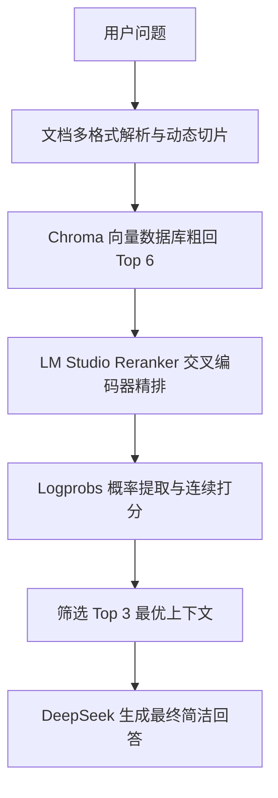

# RAG 增强检索与重排系统集成指南

本项目实现了一套基于 **Chroma 向量检索（粗回）** 与 **大模型 Logits 概率预测重排（精排）** 的 RAG（检索增强生成）流程。本文档总结了该方案的核心设计、核心组件代码以及快速集成与部署步骤，以便于其他 Agent 能够一键式将其部署或迁移到其他项目中。

---

## 1. 架构设计概述

整个 RAG 检索生成链路分为以下四个阶段：



1. **多格式文档解析与动态切片**：
   * 支持 `.txt`、`.md`、`.pdf`、`.docx` 等多种格式文件解析。
   * 支持**固定长度切片**与**递归字符切片**双模式，配有 `chunk_size` 和 `chunk_overlap` 动态配置。
2. **粗回（Recall）**：
   * 使用本地 LM Studio 托管的 `text-embedding-qwen3-embedding-0.6b` 模型（或其它兼容 OpenAI 的 Embedding 模型）提取向量。
   * 从 Chroma DB 中检索最相关的 $K$ 个（默认 $K=6$）候选文本块。
3. **精排（Rerank）**：
   * 将问题与候选文本块拼接，调用本地托管的 `qwen3-reranker-0.6b` 交叉编码器模型。
   * **核心得分计算**：不通过生成文本判断，而是直接提取模型输出第一个 Token 时的 **Logits（概率分布）**。使用公式：$\text{Score} = \frac{P(\text{Yes})}{P(\text{Yes}) + P(\text{No})} \times 10.0$ 计算获得 `0.0` 至 `10.0` 的连续相关性得分。
   * 若精排服务异常，系统会自动平滑降级（保留向量数据库原始检索排序，得分为 `-1.0` 标识），保证高可用性。
4. **生成（Generation）**：
   * 将精排前 3 名（Top 3）的文本块作为 Context 拼装进 System Prompt。
   * 调用 `DeepSeek-V4-Flash` 模型生成最终的中文简洁回答。

---

## 2. 核心技术栈与依赖

```toml
# 推荐使用的依赖项 (uv / pip 兼容)
dependencies = [
    "chromadb>=1.5.9",
    "fastapi>=0.136.1",
    "langchain-community>=0.4.1",
    "langchain-core>=1.4.0",
    "langchain-deepseek>=1.0.1",
    "openai>=2.36.0",
    "python-dotenv>=1.2.2",
    "requests>=2.34.0",
    "pypdf>=6.12.0",      # 必须：PDF 解析支持
    "docx2txt>=0.9",      # 必须：Word 解析支持
]
```

---

## 3. 核心组件代码实现

如果您需要将此方案接入到其他项目中，可以直接提取并复用以下核心 Python 组件类。

### 3.1 极简自定义 Embedding (支持 OpenAI 端点)

避免 LangChain 自带的 OpenAI 客户端在非 OpenAI 域名下的版本兼容问题，直接使用最底层的原始 HTTP/OpenAI SDK 构造：

```python
from langchain_core.embeddings import Embeddings
from openai import OpenAI

class LMStudioEmbeddings(Embeddings):
    """直接调用兼容 OpenAI 的 Embedding API 端点"""
    def __init__(self, model: str, base_url: str):
        self.model = model
        self.client = OpenAI(base_url=base_url, api_key="lm-studio")

    def embed_documents(self, texts: list[str]) -> list[list[float]]:
        response = self.client.embeddings.create(input=texts, model=self.model)
        return [item.embedding for item in response.data]

    def embed_query(self, text: str) -> list[float]:
        response = self.client.embeddings.create(input=text, model=self.model)
        return response.data[0].embedding
```

### 3.2 大模型 Logits/Logprobs 连续打分精排器 (LMStudioReranker)

核心逻辑是通过 Open Responses 协议向 LM Studio 的 `/v1/responses` 接口请求 logprobs 并计算：

```python
import math
import requests

class LMStudioReranker:
    """
    通过大模型 Logprobs 连续打分实现重排
    """
    def __init__(self, model: str, base_url: str, top_n: int = 3):
        self.model = model
        self.base_url = base_url.rstrip("/")
        self.top_n = top_n

    def _score_single(self, query: str, doc_content: str) -> float:
        url = f"{self.base_url}/responses"
        input_data = [
            {"role": "system", "content": "你是一个文档相关性判定助手。你必须只回答 'yes' 或 'no'，不要输出任何解释或前缀。"},
            {"role": "user", "content": f"用户问题：{query}\n参考文档：{doc_content}\n该文档是否相关，能回答该问题吗？请仅回答 'yes' 或 'no'。是否相关:"}
        ]
        payload = {
            "model": self.model,
            "input": input_data,
            "include": ["message.output_text.logprobs"],
            "top_logprobs": 20,
            "temperature": 0.0,
            "max_tokens": 10
        }
        try:
            resp = requests.post(url, json=payload, timeout=15)
            if resp.status_code != 200:
                return -1.0
            
            resp_data = resp.json()
            logprobs = None
            full_text = ""
            for out_item in resp_data.get("output", []):
                if out_item.get("type") == "message":
                    for content_item in out_item.get("content", []):
                        if content_item.get("type") == "output_text" and "logprobs" in content_item:
                            logprobs = content_item["logprobs"]
                            full_text = content_item.get("text", "")
                            break

            if not logprobs:
                return 10.0 if "yes" in full_text.lower() else 0.0

            yes_tokens = {"yes", "Yes", "YES"}
            no_tokens = {"no", "No", "NO"}

            for token_info in logprobs:
                token_str = token_info.get("token", "").strip()
                if token_str.lower() in {"yes", "no"}:
                    top_logprobs = token_info.get("top_logprobs", [])
                    yes_lp, no_lp = -99.0, -99.0
                    for tl in top_logprobs:
                        tl_token = tl.get("token", "").strip()
                        tl_val = float(tl.get("logprob", -99.0))
                        if tl_token in yes_tokens:
                            yes_lp = max(yes_lp, tl_val)
                        elif tl_token in no_tokens:
                            no_lp = max(no_lp, tl_val)
                            
                    if yes_lp > -99.0 or no_lp > -99.0:
                        p_yes = math.exp(yes_lp) if yes_lp > -99.0 else 0.0
                        p_no = math.exp(no_lp) if no_lp > -99.0 else 0.0
                        if p_yes + p_no > 0:
                            return round((p_yes / (p_yes + p_no)) * 10.0, 2)
                    return 10.0 if token_str.lower() == "yes" else 0.0
            return 10.0 if "yes" in full_text.lower() else 0.0
        except Exception:
            return -1.0

    def rerank_with_scores(self, query: str, documents: list) -> list:
        if not documents:
            return []
        scored = []
        has_error = False
        for i, doc in enumerate(documents):
            score = self._score_single(query, doc.page_content)
            if score < 0.0:  # 接口异常自动降级
                has_error = True
                break
            scored.append((i, score, doc))
        
        if has_error:
            return [(i, -1.0, doc) for i, doc in enumerate(documents)]
        
        scored.sort(key=lambda x: (-x[1], x[0]))
        return scored
```

### 3.3 动态多格式文档加载器 (Document Router)

根据文件扩展名动态解析，并执行去重增量录入逻辑：

```python
import os
from langchain_community.document_loaders import TextLoader, PyPDFLoader, Docx2txtLoader

def load_document(file_path: str):
    ext = os.path.splitext(file_path)[1].lower()
    if ext in [".txt", ".md"]:
        return TextLoader(file_path, encoding="utf-8").load()
    elif ext == ".pdf":
        return PyPDFLoader(file_path).load()
    elif ext == ".docx":
        return Docx2txtLoader(file_path).load()
    else:
        raise ValueError(f"不支持的格式: {ext}")
```

---

## 4. 环境变量配置 (`.env`)

在需要集成的项目根目录下，必须创建并配置 `.env` 文件：

```env
# 核心大模型生成配置 (以 DeepSeek 官方为例)
DEEPSEEK_API_KEY=your_deepseek_api_key_here

# 本地 LM Studio 配置（如果使用不同的端口，请在此处修改）
# EMBEDDING_BASE_URL=http://localhost:1234/v1
# RERANK_BASE_URL=http://localhost:1234/v1
```

---

## 5. 迁移与部署指南 (供 Agent 参考)

若要部署本套 RAG 模块，请让执行的 Agent 遵循以下步骤：

### 第一步：准备第三方环境 (LM Studio)
1. 下载并安装 LM Studio 客户端。
2. 并在搜索下载并加载这两个模型：
   * 向量嵌入模型：`text-embedding-qwen3-embedding-0.6b` (或等价的 BGE 模型)。
   * 精排 Reranker 模型：`qwen3-reranker-0.6b`。
3. 在 LM Studio 侧边栏开启 Local Server，监听默认端口 `1234`。

### 第二步：克隆代码及结构
创建如下目录结构：
```text
your-project/
├── chroma_db/             # Chroma 数据库持久化目录
├── documents/             # 预存知识文档目录 (.txt, .md, .pdf, .docx)
├── static/                # 前端控制台静态资源
│   ├── index.html
│   ├── script.js
│   └── style.css
├── app.py                 # FastAPI Web 后端入口
├── rag.py                 # RAG 处理核心逻辑
├── .env                   # 运行环境变量
└── pyproject.toml         # 依赖配置文件
```

### 第三步：启动后台服务
在终端运行以下命令开启 FastAPI 服务：
```bash
# 推荐使用 uv 运行（自动创建虚拟环境并管理依赖）
uv run python -m uvicorn app:app --port 8000 --host 127.0.0.1
```

### 第四步：使用与调试
1. 打开浏览器进入 `http://127.0.0.1:8000`。
2. 拖入任意文档（如 PDF 文档），在日志打印“切片增量入库成功”后，在顶部框输入相关问题即可进行 Recall+Rerank 的 RAG 联合调试。
